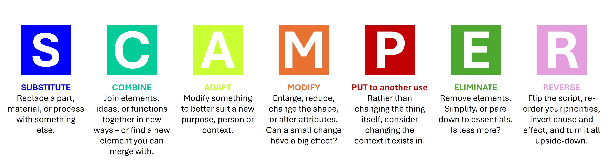
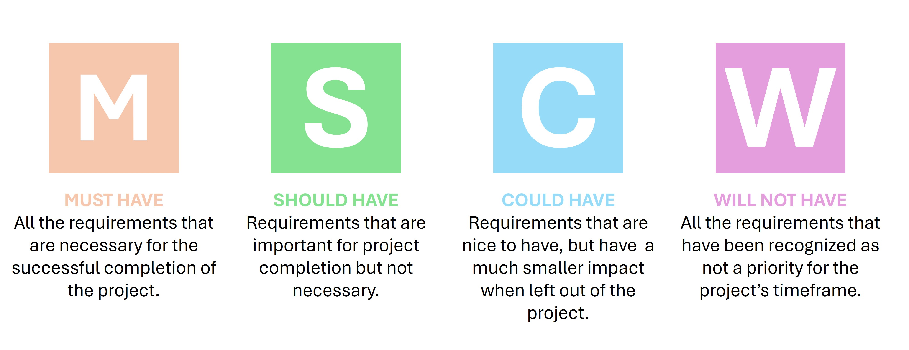
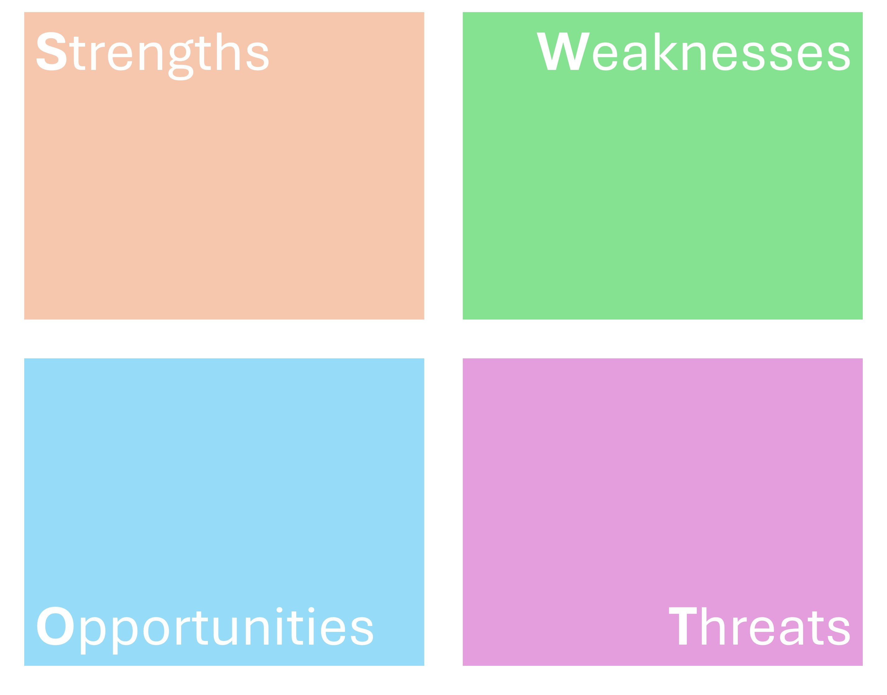
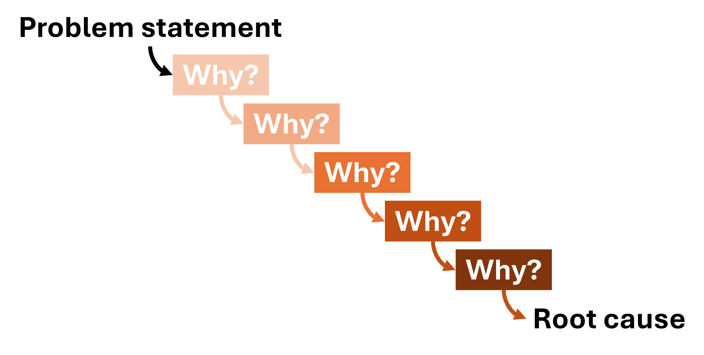
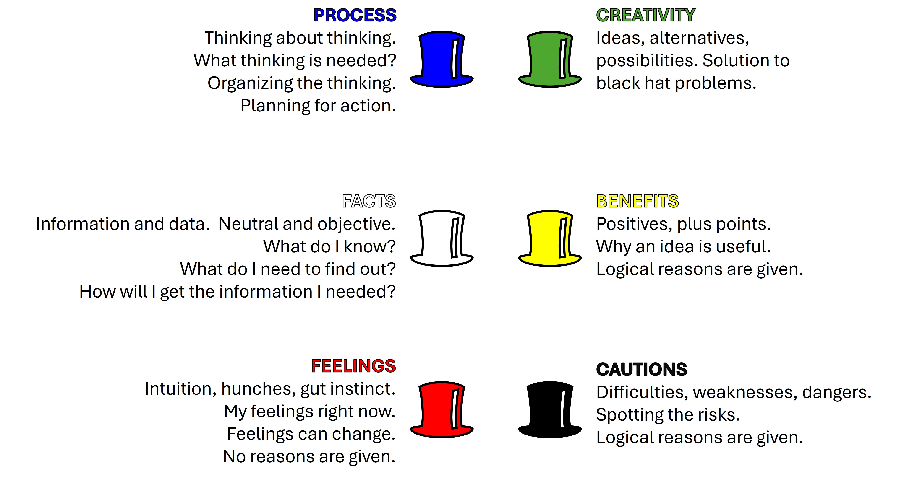
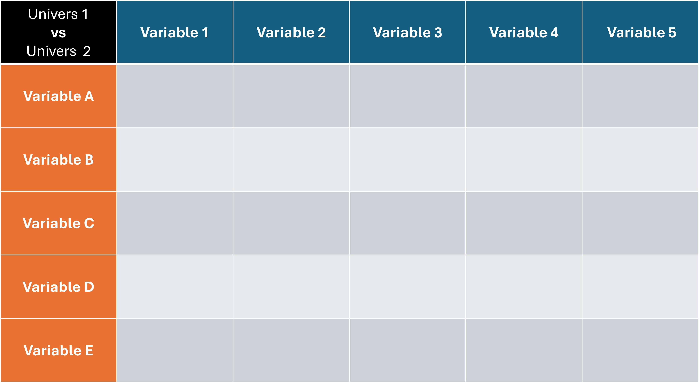
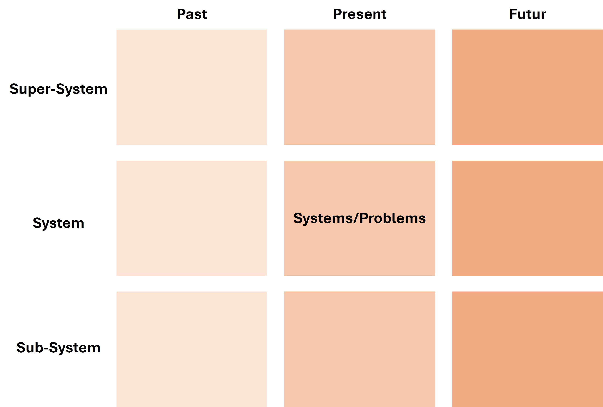

# SCAMPER Method

The SCAMPER method is a creative thinking technique used to generate new ideas or improve existing products, services, or processes. The acronym SCAMPER stands for:

- **S**ubstitute: Replace a part of the product, service, or process with something else.
- **C**ombine: Merge two or more elements to create something new.
- **A**dapt: Modify or adjust an existing element to better suit the needs or context.
- **M**agnify/Minify: Change the size, scale, or quantity of an element.
- **P**ut to another use: Find new applications or uses for an existing element.  
- **E**liminate: Remove an element or feature to simplify or improve the product, service, or process.
- **R**earrange/Reverse: Change the order or orientation of elements to create a new perspective or solution.

{#scamper-container width="100%"}

# MoSCoW Method

The MoSCoW method is a prioritization technique used in project management and software development to help stakeholders categorize requirements or features based on their importance. The acronym MoSCoW stands for:

- **M**ust have: These are critical requirements that are non-negotiable and must be included in the final product for it to be considered successful.
- **S**hould have: These are important requirements that are not critical but add significant value. They should be included if possible, but the project can still succeed without them.
- **C**ould have: These are desirable requirements that can enhance the product but are not essential. They can be included if time and resources permit.
- **W**on't have (this time): These are requirements that are agreed to be left out of the current project scope but may be considered for future iterations.

{#moscow-container width="50%"}

# SWOT Analysis

SWOT analysis is a strategic planning tool used to identify and evaluate the Strengths, Weaknesses, Opportunities, and Threats related to a project, organization, or business venture. It helps in understanding internal and external factors that can impact success.

- **Strengths**: Internal attributes and resources that support a successful outcome. Examples include a strong brand, skilled workforce, or proprietary technology.
- **Weaknesses**: Internal factors that could hinder success. Examples include limited resources, lack of expertise, or poor location.
- **Opportunities**: External factors that the project or organization can capitalize on to achieve its goals. Examples include market growth, technological advancements, or changes in regulations.
- **Threats**: External factors that could pose challenges or risks to success. Examples include competition, economic downturns, or changing consumer preferences.

{#swot-container width="50%"}

# 5 Whys Method

The 5 Whys method is a problem-solving technique used to explore the root cause of an issue by asking "Why?" multiple times (typically five). The goal is to move beyond the symptoms of a problem to uncover the underlying cause. The process involves the following steps:

1. **Identify the Problem**: Clearly define the problem you are facing.
2. **Ask Why**: Ask why the problem is occurring and write down the answer.
3. **Repeat**: For each answer, ask "Why?" again and write down the new answer. Continue this process until you have asked "Why?" five times or until you reach the root cause.
4. **Analyze**: Review the answers to identify the root cause of the problem.

{#5whys-container width="50%"}

# Six Thinking Hats

The Six Thinking Hats is a decision-making and problem-solving technique developed by Edward de Bono. It involves looking at a problem from six different perspectives, each represented by a colored hat:

1. **White Hat**: Focuses on facts, data, and information. It involves gathering and analyzing objective information without emotions or opinions.
2. **Red Hat**: Represents emotions and feelings. It allows individuals to express their intuitions and gut reactions without the need for justification.
3. **Black Hat**: Involves critical thinking and caution. It focuses on identifying potential risks, challenges, and negative outcomes.
4. **Yellow Hat**: Represents optimism and positive thinking. It focuses on identifying benefits, opportunities, and positive outcomes.
5. **Green Hat**: Symbolizes creativity and new ideas. It encourages brainstorming, innovation, and exploring alternative solutions.
6. **Blue Hat**: Focuses on process control and organization. It involves managing the thinking process, setting objectives, and ensuring that the other hats are used effectively.

{#sixhats-container width="50%"}

# Discovery Matrix

The discovery matrix (matrice de découverte) is a two-dimensional table used to cross-combine two sets of variables to generate opportunities and reveal gaps. Empty cells represent "innovation windows" where new ideas or solutions can be explored.

{#discovery-matrix-container width="50%"}

# 6-3-5 Brainwriting Method

The 6-3-5 method is a structured brainstorming technique designed to generate a large number of ideas in a short amount of time. The name "6-3-5" refers to six participants, each writing down three ideas, and passing their ideas to the next person every five minutes. The process typically involves the following steps:

1. **Form a Group**: Gather six participants who will take part in the brainstorming session.
2. **Distribute Worksheets**: Provide each participant with a worksheet that has three columns for ideas and six rows for rounds.
3. **Set a Timer**: Set a timer for five minutes for each round of idea generation.
4. **Generate Ideas**: In the first round, each participant writes down three ideas related to the problem or challenge in the first row of their worksheet.
5. **Pass the Worksheets**: After five minutes, participants pass their worksheets to the person on their right.
6. **Build on Ideas**: In the next round, participants review the ideas on the worksheet they received and add three new ideas in the next row, building on or inspired by the previous ideas.
7. **Repeat**: Continue the process for a total of six rounds, with each participant contributing to each worksheet.
8. **Review Ideas**: After the final round, collect all the worksheets and review the ideas generated. Discuss and evaluate the ideas to identify the most promising ones for further development.

# Brainstorming

Brainstorming is a group creativity technique used to generate a large number of ideas for solving a problem or addressing a challenge. The process typically involves the following steps:

1. **Define the Problem**: Clearly state the problem or challenge that needs to be addressed.
2. **Set the Rules**: Establish ground rules for the brainstorming session, such as encouraging wild ideas, withholding criticism, and building on others' ideas.
3. **Generate Ideas**: Participants freely share their ideas in a rapid and unstructured manner. The focus is on quantity over quality, with the goal of generating as many ideas as possible.
4. **Record Ideas**: All ideas are recorded, typically on a whiteboard, flipchart, or digital tool, so that everyone can see them.
5. **Evaluate and Select**: After the brainstorming session, the group reviews the ideas, discusses them, and selects the most promising ones for further development.

# Mind Mapping

Mind mapping is a visual technique used to organize information, ideas, or concepts around a central theme or topic. It involves creating a diagram that represents relationships between different pieces of information. The process typically involves the following steps:

1. **Central Idea**: Start by writing the central idea or topic in the center of a blank page or digital canvas.
2. **Branches**: Draw branches radiating out from the central idea to represent main categories or subtopics related to the central theme.
3. **Sub-branches**: Add sub-branches to each main branch to represent more detailed information, ideas, or concepts.
4. **Keywords and Images**: Use keywords, short phrases, and images to represent ideas on the branches and sub-branches. This helps to keep the mind map concise and visually engaging.
5. **Connections**: Draw lines or arrows to show relationships between different branches or ideas, highlighting connections and associations.

# 9 Windows Method

The 9 Windows method is a systems thinking tool used to analyze a problem or system across three levels of abstraction (super-system, system, and sub-system) and three time frames (past, present, and future). The method involves creating a 3x3 matrix with the following structure:

1. **Levels of Abstraction**:
   - **Super-System**: The larger context or environment in which the system operates.
   - **System**: The main focus or subject of analysis.
   - **Sub-System**: The components or parts that make up the system.
2. **Time Frames**:
   - **Past**: The historical context or previous state of the system.
    - **Present**: The current state or situation of the system.
    - **Future**: The anticipated or desired future state of the system.

{#9windows-container width="50%"}

# C-K Theory

C-K Theory (Concept-Knowledge Theory) is a design theory that focuses on the relationship between concepts (C) and knowledge (K) in the innovation process. It emphasizes the expansion of both concepts and knowledge to generate new ideas and solutions. The theory involves two main spaces:

1. **Concept Space (C)**: This space contains ideas, concepts, and potential solutions that are not yet fully defined or validated. Concepts are often vague and open to exploration.
2. **Knowledge Space (K)**: This space contains established knowledge, facts, and information that can be used to support and validate concepts. Knowledge is more concrete and well-defined.

The innovation process involves iteratively expanding both the concept space and the knowledge space, leading to the development of new and innovative solutions.

# Double Diamond Model

The Double Diamond model is a design process framework developed by the British Design Council. It consists of four phases divided into two diamonds: Discover, Define, Develop, and Deliver.

1. **Discover**: This phase involves researching and gathering insights about the problem or opportunity. It includes activities such as user research, market analysis, and stakeholder interviews to understand the context and needs.
2. **Define**: In this phase, the insights gathered during the Discover phase are analyzed and synthesized to define the core problem or challenge. This phase focuses on narrowing down the focus and creating a clear problem statement or brief.
3. **Develop**: The Develop phase is where ideas and solutions are generated and prototyped. It involves brainstorming, ideation sessions, and creating prototypes to explore different approaches to solving the defined problem.
4. **Deliver**: The final phase involves testing, refining, and implementing the chosen solution. It includes user testing, feedback collection, and finalizing the design for launch or production.

# Canvas Business Model

The Business Model Canvas is a strategic management tool used to visualize and describe a business model. It consists of nine key building blocks that represent different aspects of a business:

1. **Customer Segments**: Defines the different groups of people or organizations that the business aims to serve.
2. **Value Propositions**: Describes the unique value that the business offers to its customers.
3. **Channels**: Outlines the various ways the business delivers its value proposition to customers.
4. **Customer Relationships**: Describes the types of relationships the business establishes with its customers.
5. **Revenue Streams**: Identifies the sources of revenue for the business. 
6. **Key Resources**: Lists the essential assets and resources required to deliver the value proposition.
7. **Key Activities**: Describes the critical activities the business must perform to operate successfully.
8. **Key Partnerships**: Identifies the external organizations or partners that help the business achieve its objectives.
9. **Cost Structure**: Outlines the major costs and expenses associated with running the business.
