# Vision: Programmable Matter

The cinema and entertainment industries frequently present speculative visions of future technologies, serving as a bridge between scientific discourse and the collective imagination. Many films and television series, for instance, explore the concept of transformative materials and environments capable of dynamic reconfiguration, as illustrated in @fig-scifi.\
In X-Men (2000), the surface of a round table morphs to form a miniature city model, aiding in the visualization of a collective battle strategy as illustrated by @fig-scifi-1.\
In Man of Steel (2012), the interior of an alien ship materializes a physical key from a surface composed of microscopic robots—an object the protagonist can subsequently remove and use, as shown in @fig-scifi-2.\
In Big Hero 6 (2014), the protagonist controls a swarm of microbots that assemble into various shapes and structures through thought alone, which is depicted in @fig-scifi-3.\
In The Matrix Revolutions (2003), a general artificial intelligence manifests itself by commanding a swarm of robots that coalesce into a large humanoid form during its interaction with the protagonist, as seen in @fig-scifi-4.\
In Avengers: Infinity War (2018), one of the protagonist’s suits, composed of nanobots, dynamically reconfigures to adapt to different combat scenarios, illustrated by @fig-scifi-5.\
Finally, in The Suicide Squad (2021), a character’s firearm physically reconfigures as components are attached or detached, enabling or disabling specific functions, as demonstrated in @fig-scifi-6.

::: {#fig-scifi layout-ncol=3 fig-align="center"}

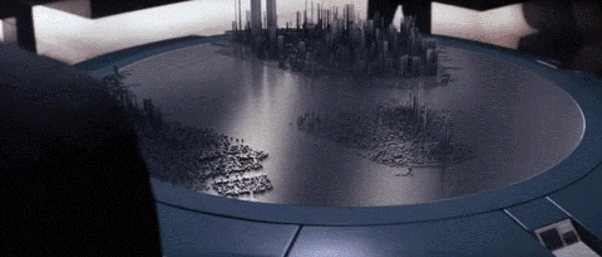{#fig-scifi-1}

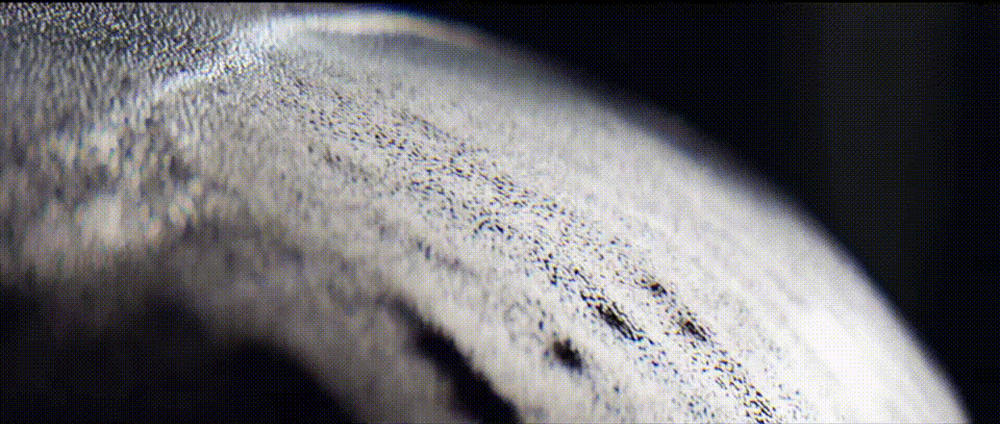{#fig-scifi-2}

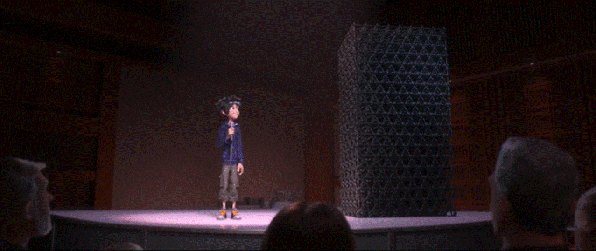{#fig-scifi-3}

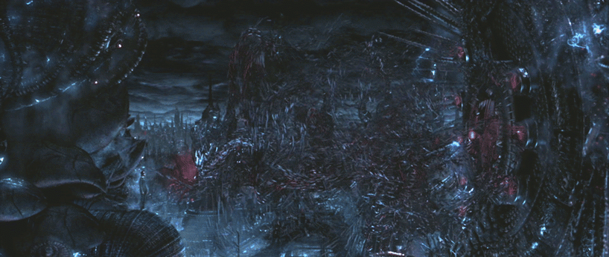{#fig-scifi-4}

{#fig-scifi-5}

{#fig-scifi-6}

Sci-Fi interpretations of Programmable Matter
:::

In research, this speculative idea corresponds to what is known as *Programmable Matter* — a technological paradigm representing the convergence of computation and physical materiality, where algorithms are embedded within matter itself, enabling it to sense, compute, and reconfigure its own structure or properties. The conceptual roots of this vision can be traced back to @sutherland1965ultimate, in which Sutherland envisioned a computer capable of "controlling the existence of matter".

Today, this vision unites a range of research domains as shown in @fig-programmable-matter-venn, including self-reconfiguring modular robotics within **Robotics** (e.g., @yim2007modular), smart materials and metamaterials in **Materials Science** (e.g., @pishvar2020foundations), and shape-changing interfaces within **Human–Computer Interaction** (e.g., @rasmussen2012shape).

::: {#fig-programmable-matter-venn}

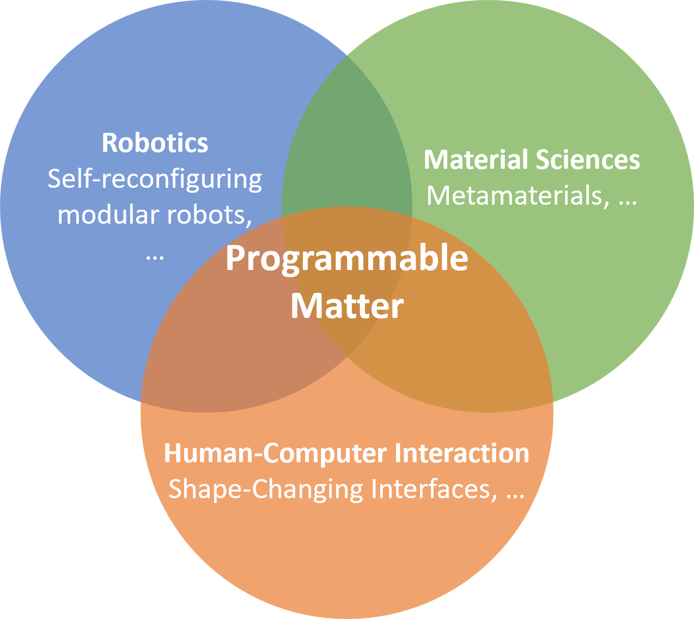{width=300}

Venn Diagram of Research Fields Contributing Towards Programmable Matter
:::

<!--
This vision has often inspired the cinema and entertainment industries to explore speculative interpretations of programmable matter, portraying it as a transformative material capable of dynamic reconfiguration. Conversely, these fictional representations can in turn inspire researchers, offering qualitative illustrations of what programmable matter could become.
Conversely, these fictional representations can in turn inspire researchers, offering qualitative illustrations of what programmable matter could become. I personnally use these illustrations as valuable cultural references when communicating with the public or popularizing research, helping to bridge scientific discourse and collective imagination
 -->

# Research Field: Shape-Changing Interfaces in Human-Computer Interaction

Nowadays, Graphical User Interfaces (GUIs) are ubiquitous in our societies offering flexibility and interactivity through graphical elements within a limited two-dimensional (2D) space (e.g., phones, tablets, laptops). While GUIs provide a high degree of malleability, allowing users to manipulate digital content with relative ease, they are constrained by the abstraction of the 2D screen. In contrast, Tangible User Interfaces (TUIs) [@ishii_tangible_1997;@ishii_tangible_2008] leverage physical objects as interactive elements, enabling more natural and embodied interactions. TUIs support collaborative work, facilitate embodied thinking, sustain external memory, and allow parallel actions through spatially distributed interactions [@shaer_tangible_2010]. By grounding interactions in the physical, three-dimensional (3D) world, TUIs leverage human cognitive, motor, and collaborative abilities that have evolved over millennia through hands-on experience with real-world objects. 

However, despite these advantages, TUIs are inherently limited in terms of malleability. Unlike GUIs, the physical properties of tangible objects -- such as position, orientation, shape, color, and transparency -- cannot be easily or dynamically modified through software, which restricts their adaptability and versatility in supporting a wide range of interaction scenarios. 
Without malleability, TUIs will remain perpetually outpaced by GUIs. Therefore, a key design challenge emerges towards the development of interfaces that combine the flexibility of GUIs with the embodied richness of TUIs.

Aligned with *Programmable Matter*, Shape-changing interfaces (SCIs) aim to blur the boundary between physical and virtual objects, combining the physicality of Tangible User Interfaces (TUIs) with the malleability of Graphical User Interfaces (GUIs) [@ishii_radical_2012;@shaer_tangible_2010; @strohmeier_sharing_2016] (see @fig-radical-atoms): They are interactive devices performing physical transformations in response to user inputs or system events, enabling them to convey information, meaning, or affect [@alexander_grand_2018]. 

::: {#fig-radical-atoms}

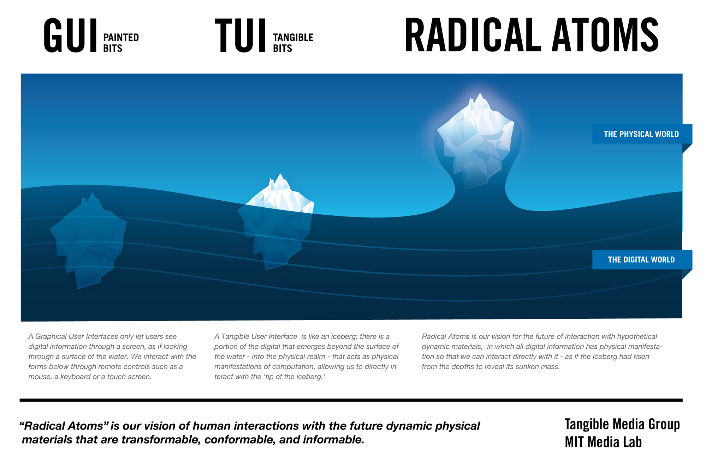{width="80%"}

Shape-Changing Interfaces (Radical Atoms) in the landscape of human-technology interactions
:::

To realize interfaces with physically reconfigurable geometry, researchers integrate combinations of sensors, hard or soft actuators, and smart materials into surfaces or volumes. These reconfigurable geometries can function as both input and output and are computationally controlled [@alexander_grand_2018].
The types of shape transformations explored in prior work include changes in orientation, form, volume, texture, viscosity, spatial configuration, material addition/removal, and permeability [@rasmussen_shape_2012].
Various actuated architectures for SCIs have emerged in recent years including sparse dots [@le_goc_zooids_2016], sparse lines [@suzuki_shapebots_2019], single lines [@nakagaki_lineform_2015], voxels [@suzuki_dynablock_2018], layers [@yim_animatronic_2018], surfaces [@belke_mori_2017], hub and structs [@katsumoto_inside_2020], string arrays [@engert_straide_2022], and pin arrays [@taher_exploring_2015].
Each of these architectures enables the exploration of one or more types of shape transformations. This diversity is necessary, as no single interface can realize all possible transformations, highlighting the current absence of fully programmable matter.

::: {#fig-sci-architectures layout-ncol=5 fig-align="center"}

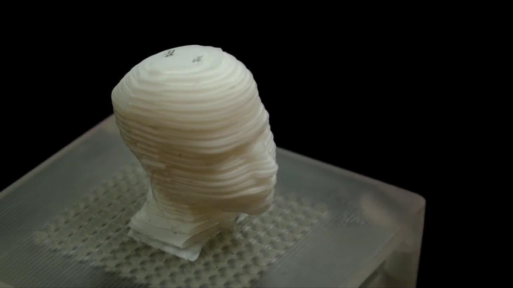{#fig-sci-architectures-1}

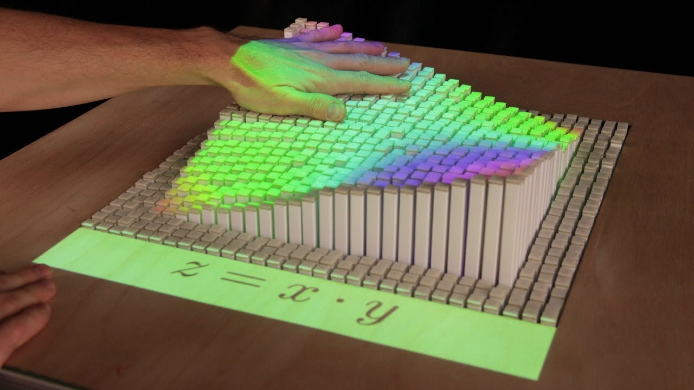{#fig-sci-architectures-2}

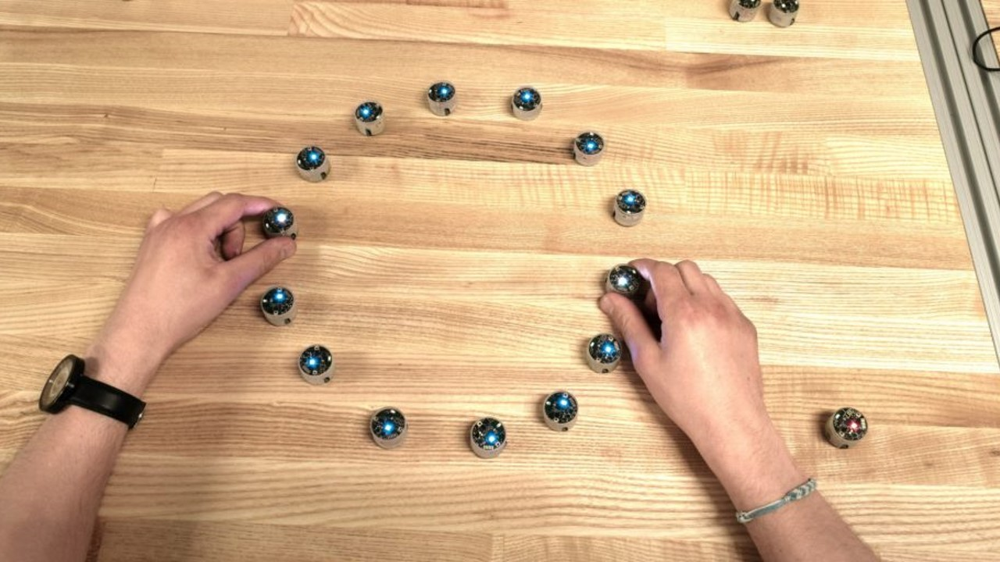{#fig-sci-architectures-3}

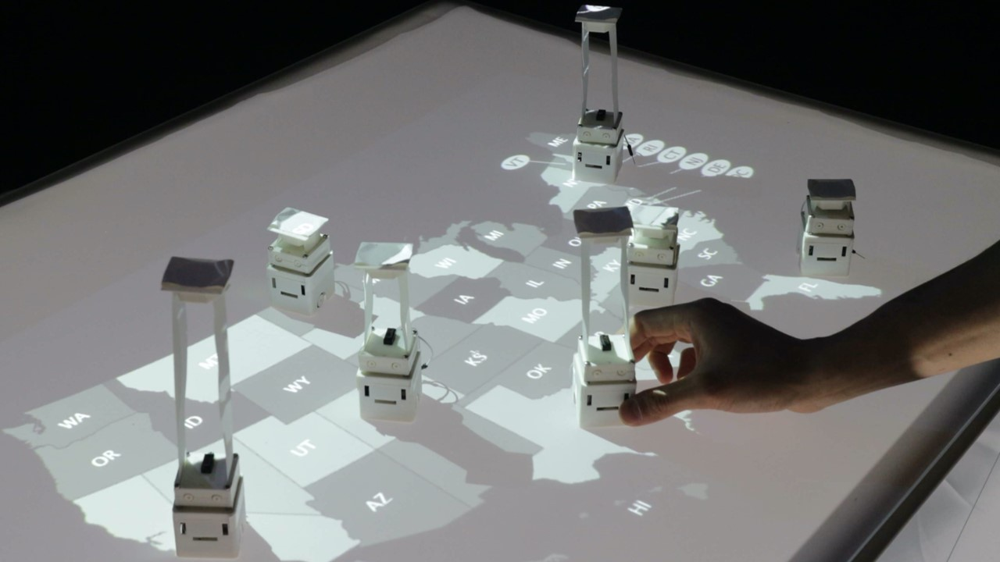{#fig-sci-architectures-4}

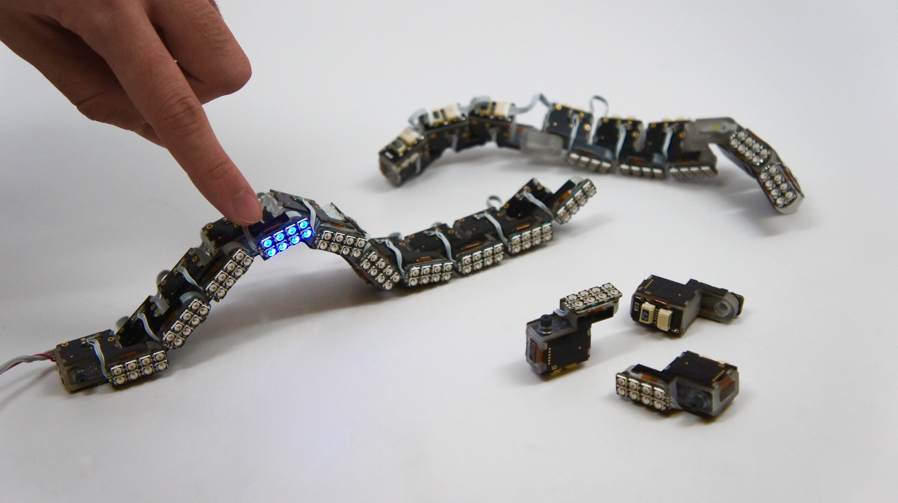{#fig-sci-architectures-5}

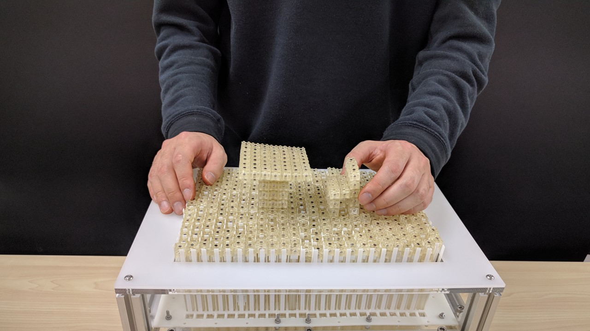{#fig-sci-architectures-6}

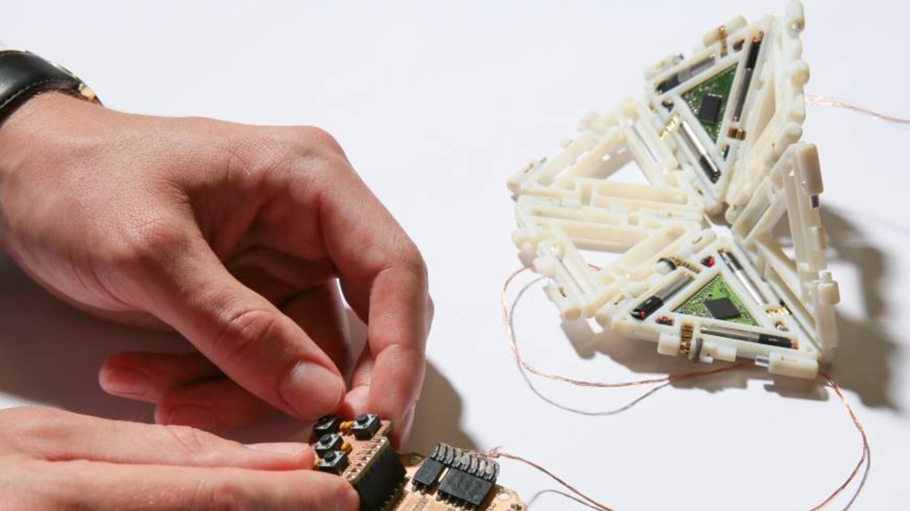{#fig-sci-architectures-7}

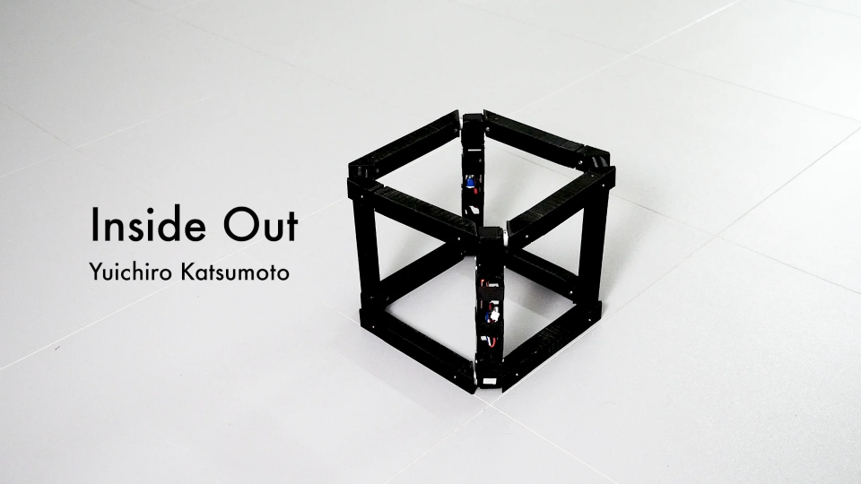{#fig-sci-architectures-8}

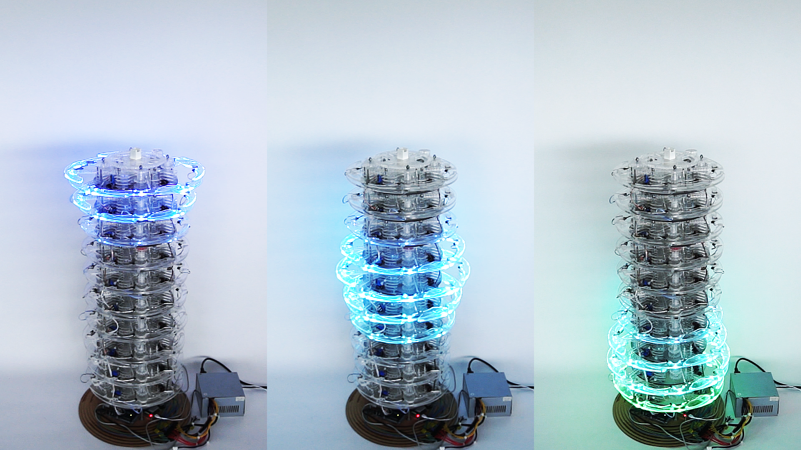{#fig-sci-architectures-9}

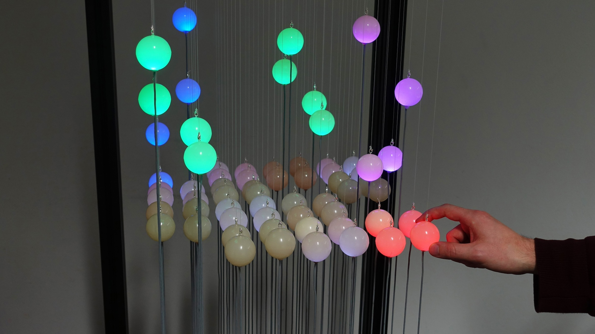{#fig-sci-architectures-10}

Actuated Architectures for Shape-Changing Interfaces
:::

Various purposes of SCIs have been demonstrated [@alexander_grand_2018], such as:

- communicating information through combinations of visual, haptic, and shape animation (e.g., dynamic physical bar charts by @taher_exploring_2015); 
- physically simulating real or imaginary objects (e.g., a simulated human spine by @chacon_spinallog_2019); 
- adapting shape to specific interaction contexts (e.g.,  a reconfigurable game controller by @roudaut_cubimorph_2016);
- augmenting elements of or within the user's body (e.g.,  a sixth finger by @prattichizzo_sixthfinger_2014); 
- supporting aesthetic, sensorial, or entertainment goals (e.g., kinetic garments by @berzowska_kukkia_2005).

::: {#fig-sci-purposes layout-ncol=4 fig-align="center"}

{#fig-sci-purposes-1}

{#fig-sci-purposes-2}

{#fig-sci-purposes-3}

{#fig-sci-purposes-4}

{#fig-sci-purposes-5}

Known purposes of Shape-Changing Interfaces
:::

# Research Agenda: Grand Challenges in Technology, User Behavior, Design, Ethics, Policy, and Sustainability

To advance SCIs, Alexander et al.~\cite{alexander_grand_2018} identified twelve grand challenges across four domains: \textit{technology}, \textit{user behavior}, \textit{design}, and \textit{policy, ethics, and sustainability}.

# My Contributions

CairnFORM -> Technology, User Behavior, Design
architectures: ring stacks
purposes: communicate information, simulate objects, adapt interfaces, entertain audience

ShyPins -> Technology, User Behavior, Policy
architectures: pin arrays
purposes: communicate information, simulate objects, adapt interfaces, entertain audience
contributions: safety strategy to preserve user physical and mental well-being when interacting with shape-changing interfaces.

# My Perspectives

# Teaching

# References

::: {#refs}
:::