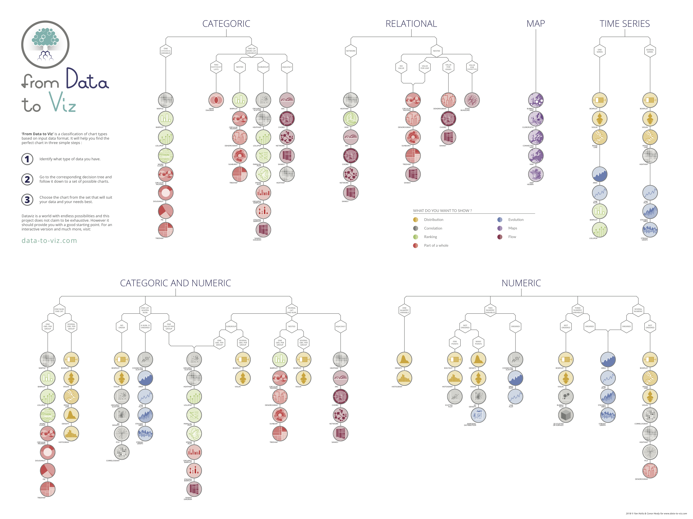

## What types of data do I have?

- Qualitative nominale (categorical): gender
- Qualitative ordinale (ordinal): Likert scale
- Quantitative (numerical): time to complete a task

## What descriptive statistics should I use on my data?

- mean
- median
- mode
- min
- max
- standard deviation
- variance
- percentiles
- frequency distribution

## What frequentist statistics should I use on my data?

- bootstrap confidence intervals

## What inferential statistics should I use on my data?

source: [BiostaTGV]{https://biostatgv.sentiweb.fr/?module=tests},  [Statistical Methods for HCI Research by Koji Yatani](https://yatani.jp/teaching/doku.php?id=hcistats:start)

<table class="table table-sm">
    <thead>
        <tr>
            <th colspan="3"></th>
            <th colspan="4">
                <h4>Answer Variable <small>Tasks, etc.</small></h4>
            </th>
        </tr>
        <tr>
            <th colspan="3"></th>
            <th>
                <h4>Qualitative nominale (2 groups) <small>Gender (woman, man), etc.</small></h4>
            </th>
            <th>
                <h4>Qualitative nominale (3+ groups) <small>Ethnicity (Black, White, Hispanic, non-Hispanic), etc.</small></h4>
            </th>
            <th>
                <h4>Qualitative ordinale <small>Fatigue (5-points Likert Scale), etc.</small></h4>
            </th>
            <th>
                <h4>Quantitative <small>Completion speed (seconds), etc.</small></h4>
            </th>
        </tr>
    </thead>
    <tbody>
        <tr>
            <th rowspan="5">
                <h4>Study Factor <small>Interaction technique, etc.</small></h4>
            </th>
            <th rowspan="2">
                <h4>Qualitatif (2 groups) <small>Two interaction techniques, etc.</small></h4>
            </th>
            <th>
                <h4>Independants <small>Between groups, etc.</small></h4>
            </th>
            <td>Z de comparaison de proportions Chi² Test exact de Fisher</td>
            <td>Chi²</td>
            <td>Test de Cochran-Armitage</td>
            <td>Test de Mann-Whitney t de Student Test de Weich</td>
        </tr>
        <tr>
            <th>
                <h4>Appariés <small>Within groups, etc.</small></h4>
            </th>
            <td>Test de McNemar Test exact de Fisher</td>
            <td>Q de Cochran</td>
            <td>Tests des signes Tests des rangs signés de Wilcoxon</td>
            <td>t de Student pour données appariées Test des rangs signés de Wilcoxon</td>
        </tr>
        <tr>
            <th rowspan="2">
                <h4>Qualitatif (3+ groups) <small>Four visualization techniques, etc.</small></h4>
            </th>
            <th>
                <h4>Independants <small>Between groups, etc.</small></h4>
            </th>
            <td>Chi²</td>
            <td>Chi²</td>
            <td>Test de kruskal-Wallis (ordinal)</td>
            <td>Analyse de la variance Test de Kruskal-Wallis (échelle quanti)</td>
        </tr>
        <tr>
            <th>
                <h4>Appariés <small>Within groups, etc.</small></h4>
            </th>
            <td>Q de Cochran</td>
            <td>Q de Cochran</td>
            <td>Test de Friedman</td>
            <td>Test de Friedman</td>
        </tr>
        <tr>
            <th colspan="2">
                <h4>Quantitatif <small>Gestures, etc.</small></h4>
            </th>
            <td>Régression logistique</td>
            <td>Régression logistique multinomiale</td>
            <td>Corrélation de Spearman Tau de Kendall</td>
            <td>Corrélation de Pearson Régression linéaire</td>
        </tr>
    </tbody>
</table>

## What bayesian statistics should I use on my data?

- Researcher-Centered Design of Statistics: Why Bayesian
Statistics Better Fit the Culture and Incentives of HCI (Matthew Kay)

- HCI Statistics without p-values (Pierre Dragicevic)

## What plot should I use for my data?

All credits to [data-to-viz.com](https://www.data-to-viz.com/).

::: {#fig-from-data-to-viz fig-align="center"}

{width="100%"}

Interpretations of Programmable Matter in Science-Fiction
:::